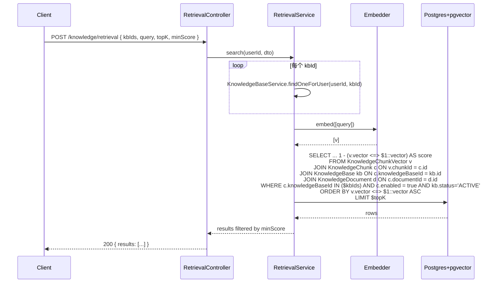

# feat: Knowledge retrieval service (PGVector)

## Overview

新增 `knowledge/retrieval` 子模块：用 PGVector 把 chunk 向量真正落库，提供多 KB 语义相似度检索 HTTP API、KB 粒度的回填 reindex API；ingest 与 chunk 编辑路径补上向量同步。本期不接 workflow 节点（仅保证 service 层可被复用）。

## Problem Frame

`apps/backend/src/modules/knowledge/documents/knowledge-document.service.ts:77` 已调 embedder，但 `:106-118` 的 chunk 写库把 `vectorId` 写成 NULL，向量直接丢弃，无法做检索。需要补上向量持久化与查询能力，且与现有 Postgres+Prisma 主架构对齐（不引入 Milvus / ES）。详见 origin: `docs/brainstorms/2026-06-06-knowledge-retrieval-service-requirements.md`。

## Requirements Trace

- R1. 上传新文档后，`KnowledgeChunkVector` 行数 = chunks 行数（origin §成功标准 1）
- R2. `POST /knowledge/retrieval` 多 KB 语义检索 + TopK + MinScore + workspace 鉴权（origin §行为规格 2）
- R3. `POST /knowledge/bases/:id/reindex?force=` KB 粒度回填（origin §行为规格 3）
- R4. 编辑 chunk 内容同步重算 vector；删除靠外键级联；禁用走检索过滤（origin §行为规格 4）
- R5. 跨 workspace 调 retrieval 返回 403（origin §成功标准 6）
- R6. 删除文档后对应 vector 全部消失（origin §成功标准 4）

## Scope Boundaries

- 不做全文 / 混合检索 / RRF 融合
- 不做 query rewrite（不调 LLM 改写）
- 不做 rerank、NL2SQL
- 不做切换 embedder 模型后的自动迁移
- 不删除 `KnowledgeChunk.vectorId` 字段，仅停止写入（避免触碰其它模块）

### Deferred to Separate Tasks

- workflow `knowledge_retrieve` 节点执行器：本期仅保证 `RetrievalService` 可注入，节点实现留独立任务

## Context & Research

### Relevant Code and Patterns

- `apps/backend/src/modules/knowledge/documents/knowledge-document.service.ts:85-122`：现有 `chunkAndIngest` 事务结构，使用 `tx.$executeRaw` 插 chunk，Unit 4 接入点
- `apps/backend/src/modules/knowledge/documents/knowledge-document.service.ts:222-240`：现有 `updateChunk`，Unit 5 接入点
- `apps/backend/src/modules/knowledge/bases/knowledge-base.service.ts:99-106`：`findOneForUser` 已封装"按 KB 校验 workspace 成员"，retrieval 鉴权直接复用
- `apps/backend/src/modules/knowledge/bases/knowledge-base.controller.ts`：controller + service + DTO 三件套样板
- `apps/backend/src/modules/knowledge/bases/__tests__/knowledge-base.service.spec.ts`：service 单测样板（mock Prisma + WorkspaceAccessService + Embedder）
- `apps/backend/src/modules/knowledge/embedding/embedder.interface.ts`：`Embedder.embed(texts)` + `model` + `dimensions`
- `apps/backend/prisma/migrations/20260605120000_add_knowledge_chunk_enabled/migration.sql`：迁移 SQL 风格
- `apps/backend/src/common/constants/error-code.ts`：错误码集中定义，60100 段为 knowledge 模块

### Institutional Learnings

- 项目规范（origin §模块结构）：`knowledge/` 下按子能力组织（bases / documents / chunking / embedding），retrieval 沿用此结构
- `tx.$executeRaw` 已是 chunk 写入的既有手段；Prisma 的 `Unsupported("vector(N)")` 类型读写靠原生 SQL 是已落地路径

### External References

- pgvector ≥ 0.5 文档：HNSW 索引 `CREATE INDEX ... USING hnsw (col vector_cosine_ops)`；距离算子 `<=>` 是 cosine distance；相似度 = `1 - distance`
- pgvector 与 Prisma 协作：schema 用 `Unsupported("vector(N)")` 占位，读写走 `$queryRaw` / `$executeRaw`，参数用 `Prisma.sql` 拼接 vector 字面量 `'[0.1,0.2,...]'::vector`

## Key Technical Decisions

- **后端 PGVector**：复用现有 Postgres，不引入 Milvus 运维负担（origin §关键决策）
- **MVP 仅向量检索**：留接口位但不实现混合 / rerank / rewrite（origin §非目标）
- **新表 `KnowledgeChunkVector`**：单独表存 `chunkId UNIQUE + embedderModel + dim + vector`，不污染主 chunk 表，便于换模型识别
- **HNSW + cosine**：相比 IVFFlat 无需训练、查询快；OpenAI 兼容 embedding 默认归一化，cosine 是合适度量
- **同事务写向量**：ingest 时 chunks 与 vectors 在同一 `prisma.$transaction` 内写入，整体原子；embedding 调用仍在事务外（沿用现有写法）
- **同步重算**：编辑 chunk 时同步调一次 embedding 并 upsert vector（接受 1 次外部 API 往返延迟）
- **`enabled=false` 检索过滤**：不动 vector，靠 SQL `WHERE c.enabled = true` 过滤，切换零 LLM 成本
- **迁移开启 pgvector**：迁移内 `CREATE EXTENSION IF NOT EXISTS vector`，假设数据库角色具备权限（开发与本地 Docker 环境符合）

## Open Questions

### Resolved During Planning

- **vector 维度怎么定**：用 env `EMBEDDING_DIM`（默认 1024，已在 env.validation 校验），迁移里硬编码该维度；换模型需手写新迁移，本期不做动态
- **检索 SQL 是否要 join `KnowledgeBase.status`**：是。检索时 `JOIN KnowledgeBase kb ON ... WHERE kb.status = 'ACTIVE'`，绕过 DISABLED / ARCHIVED KB
- **回填的 batch 控制**：复用 `EMBEDDING_BATCH_SIZE`（已在 embedder 内部分批），上层一次性传 chunks，由 embedder 拆批
- **`search` 对 `DISABLED`/`ARCHIVED` KB 的语义**：service 层显式校验、抛 `KnowledgeBaseInvalidStatus`，不静默过滤。理由：origin §行为规格 2 第 2 步明确写"校验 KB `status=ACTIVE`"；静默过滤会让用户拿到几乎空结果而无法定位原因
- **`reindexKnowledgeBase` 对不同 KB 状态的语义**：`ACTIVE`/`DISABLED` 允许（管理员可能在准备数据），`ARCHIVED` 拒绝。理由：归档语义即"只读冻结"

### Deferred to Implementation

- **Prisma `Unsupported("vector(N)")` 的 generate 行为**：需要在第一次跑 migration 后跑 `prisma generate` 验证类型不被破坏；若 Prisma 报错，退化方案是把 `KnowledgeChunkVector` 整体在 Prisma schema 之外管理（仅迁移文件 + 原生 SQL），不放进 `schema.prisma`
- **HNSW 索引建索引耗时**：初次建表数据为 0，零成本；reindex force=true 大 KB 时索引重建非问题，因为是按行 upsert
- **测试环境是否带 pgvector**：现有 e2e `apps/backend/test/jest-e2e.json` 是否启用 Postgres + 扩展，需确认；若 e2e 缺扩展，retrieval 的端到端验证降级为 service 层单测（mock raw SQL）

## High-Level Technical Design

> *以下展示数据流与 SQL 形态，仅为方向性说明，非实现规范。*



ingest 路径补写入：

```text
chunkAndIngest:
  1. 读 file, 切分, 校验
  2. embedder.embed(chunks)            -- 事务外
  3. prisma.$transaction:
       a. INSERT KnowledgeDocument
       b. INSERT KnowledgeChunk × N    -- 已存在
       c. INSERT KnowledgeChunkVector × N  -- 新增 (Unit 4)
```

## Output Structure

```
apps/backend/src/modules/knowledge/retrieval/
  retrieval.controller.ts
  retrieval.service.ts
  retrieval.module.ts
  dto/
    retrieve-request.dto.ts
    retrieve-response.dto.ts
    reindex-response.dto.ts
  __tests__/
    retrieval.service.spec.ts
    retrieval.controller.spec.ts        # 可选，按需
apps/backend/prisma/migrations/20260606xxxxxx_add_knowledge_chunk_vector/
  migration.sql
```

## Implementation Units

- [x] **Unit 1: Prisma schema + 迁移：启用 pgvector + 新表 `KnowledgeChunkVector`**

**Goal:** 数据层就位：扩展可用、表与索引可查。

**Requirements:** R1, R6

**Dependencies:** 无

**Files:**
- Modify: `apps/backend/prisma/schema.prisma`
- Create: `apps/backend/prisma/migrations/20260606xxxxxx_add_knowledge_chunk_vector/migration.sql`

**Approach:**
- 迁移 SQL 第一行 `CREATE EXTENSION IF NOT EXISTS vector`
- 建表 `KnowledgeChunkVector`：`id` cuid PK、`chunkId` UNIQUE FK -> `KnowledgeChunk.id` `ON DELETE CASCADE`、`embedderModel` TEXT NOT NULL、`dim` INT NOT NULL、`vector vector(<EMBEDDING_DIM>)` NOT NULL、`createdAt` / `updatedAt` 默认 `NOW()`
- 建索引 `CREATE INDEX ... ON "KnowledgeChunkVector" USING hnsw ("vector" vector_cosine_ops)`
- `schema.prisma` 加 model `KnowledgeChunkVector`，向量列用 `vector Unsupported("vector(<EMBEDDING_DIM>)")`，关系字段加到 `KnowledgeChunk` 上（可选 `vectorRecord KnowledgeChunkVector?`）；维度数字与迁移一致
- 跑一次 `prisma generate` 验证类型没炸；若炸，按 §Open Questions 退化（schema 不声明，只留迁移）

**Patterns to follow:**
- 迁移文件命名 / 风格：`apps/backend/prisma/migrations/20260605120000_add_knowledge_chunk_enabled/migration.sql`
- schema.prisma 现有 KnowledgeChunk 模型与 onDelete: Cascade 写法

**Test scenarios:**
- Test expectation: none -- 纯 schema/migration 改动，行为验证由 Unit 2/4 的 service 测试覆盖
- 手动验证：`pnpm prisma migrate dev` 成功、psql `\d "KnowledgeChunkVector"` 看到 vector 列与 hnsw 索引

**Verification:**
- 迁移可前向应用且无报错
- Postgres 内 `SELECT * FROM pg_extension WHERE extname='vector'` 有一行
- `KnowledgeChunkVector` 表存在、`chunkId` 上 UNIQUE 约束存在、`vector` 列上 HNSW 索引存在

---

- [ ] **Unit 2: `RetrievalService` 核心 + 模块装配**

**Goal:** 提供 `indexChunks`、`indexSingleChunk`、`search`、`reindexKnowledgeBase` 四个方法，纯 service 层，可被 controller 与未来 workflow 节点共享。

**Requirements:** R1, R2, R3, R4, R5

**Dependencies:** Unit 1

**Files:**
- Create: `apps/backend/src/modules/knowledge/retrieval/retrieval.service.ts`
- Create: `apps/backend/src/modules/knowledge/retrieval/retrieval.module.ts`
- Create: `apps/backend/src/modules/knowledge/retrieval/__tests__/retrieval.service.spec.ts`
- Modify: `apps/backend/src/modules/knowledge/knowledge.module.ts`（导入 `RetrievalModule` 或合并 providers，使 `RetrievalService` 在 KnowledgeModule 范围内可注入）
- Modify: `apps/backend/src/common/constants/error-code.ts`（新增 `KnowledgeRetrievalQueryFailed = 60110`，留 `KnowledgeVectorDimensionMismatch = 60111` 备用）

**Approach:**
- 注入 `PrismaService`、`EMBEDDER_TOKEN`、`KnowledgeBaseService`
- `indexChunks(tx, rows: { chunkId, content, vector }[], embedderModel, dim)`：接受 Prisma `tx` 或自身的 `prisma`，逐行 `INSERT INTO "KnowledgeChunkVector" ... ON CONFLICT ("chunkId") DO UPDATE SET vector=EXCLUDED.vector, embedderModel=EXCLUDED.embedderModel, dim=EXCLUDED.dim, updatedAt=NOW()`，向量字面量 `'['||...||']'::vector`
- `indexSingleChunk(chunkId, content)`：自调 embedder 算 1 条，再调 `indexChunks`
- `search(userId, dto)`：
  - 对每个 `kbId` 调 `KnowledgeBaseService.findOneForUser(userId, kbId)`（任一抛 `BusinessException` 直接传出）
  - **校验每个 kb 的 `status === ACTIVE`**：若有任一 KB 处于 `DISABLED` 或 `ARCHIVED`，抛 `KnowledgeBaseInvalidStatus`（不静默过滤；提供明确错误信号给调用方）
  - `embedder.embed([query])` 取 vector
  - `$queryRaw` 执行 SQL（见 §High-Level Technical Design 中 mermaid 节点的 SQL 形态），按 `topK` 限制、按 `minScore` 在 SQL 端 `WHERE 1 - (...) >= $minScore` 过滤
  - join `KnowledgeChunk c` + `KnowledgeDocument d`，select `c.id`、`c.content`、`c.knowledgeBaseId`、`c.documentId`、`c.index`、`d.name`
  - SQL 内 `WHERE kb.status='ACTIVE'` 保留作为纵深防御（service 校验失败时不应到此，但防止后续重构时漏掉）
  - 返回包含 `score` 的列表
- `reindexKnowledgeBase(userId, kbId, force)`：
  - 鉴权同上（`findOneForUser`）
  - **状态校验**：`kb.status === ARCHIVED` 抛 `KnowledgeBaseInvalidStatus`；`DISABLED` 允许（管理员可能正在准备数据），`ACTIVE` 允许
  - `force=true`：先 `DELETE FROM "KnowledgeChunkVector" WHERE chunkId IN (SELECT id FROM "KnowledgeChunk" WHERE knowledgeBaseId=$1)`
  - 列 chunks（`force=true` 全列；否则 `LEFT JOIN KnowledgeChunkVector` 找出无向量的）
  - 分批喂 embedder（embedder 内部已按 `EMBEDDING_BATCH_SIZE` 拆）
  - 调 `indexChunks` 写入；维护 `processed / skipped / failed` 计数
- 错误处理：embedding 失败抛 `KnowledgeEmbeddingFailed`；SQL 失败抛 `KnowledgeRetrievalQueryFailed`；维度不一致抛 `KnowledgeVectorDimensionMismatch`

**Patterns to follow:**
- `apps/backend/src/modules/knowledge/bases/knowledge-base.service.ts` 的 service 注入与异常风格
- `apps/backend/src/modules/knowledge/documents/knowledge-document.service.ts:103-118` 的 `tx.$executeRaw` 写法

**Test scenarios:**
- Happy path: `search` 给定查询命中 K 条，按 score 降序返回 -- 验证排序与字段映射
- Happy path: `reindexKnowledgeBase` 增量模式，已有向量的 chunk 跳过，缺失的写入 -- 验证 skipped/processed 计数
- Happy path: `reindexKnowledgeBase` `force=true`，先清后写 -- 验证全量重算
- Happy path: `reindexKnowledgeBase` 对 `status=DISABLED` 的 KB 仍允许 -- 不抛错
- Edge case: `search` `topK=0` 或 `query=''` -- 抛 BadRequest（DTO 校验层即可，但加单测断言）
- Edge case: `search` 命中数 < topK -- 返回实际数，非补 null
- Edge case: `search` 全部命中 score < minScore -- 返回空列表
- Edge case: `indexChunks` 入参 vectors 维度 != configured dim -- 抛 `KnowledgeVectorDimensionMismatch`
- Error path: `search` 用户对某 kbId 无 workspace 成员资格 -- 抛 Forbidden（来自 findOneForUser）
- Error path: `search` 入参 kbIds 含 `status=DISABLED` 或 `ARCHIVED` 的 KB -- 抛 `KnowledgeBaseInvalidStatus`（service 层显式校验，不静默过滤）
- Error path: `reindexKnowledgeBase` 对 `status=ARCHIVED` 的 KB -- 抛 `KnowledgeBaseInvalidStatus`
- Error path: `embedder.embed` 抛错 -- 透传 `KnowledgeEmbeddingFailed`
- Error path: `$queryRaw` 抛错 -- 包装为 `KnowledgeRetrievalQueryFailed`
- Integration: `reindexKnowledgeBase` 后立即 `search` 能查到（service 层用真实 prisma 不现实；以分别断言"reindex 调了 indexChunks 写入" + "search SQL 含 chunkId" 间接覆盖）

**Verification:**
- 单测全绿
- service 可被 controller 注入（Unit 3 装配通过即证）

---

- [ ] **Unit 3: `RetrievalController` + DTO**

**Goal:** 暴露 HTTP 入口 `POST /knowledge/retrieval` 与 `POST /knowledge/bases/:id/reindex`。

**Requirements:** R2, R3, R5

**Dependencies:** Unit 2

**Files:**
- Create: `apps/backend/src/modules/knowledge/retrieval/retrieval.controller.ts`
- Create: `apps/backend/src/modules/knowledge/retrieval/dto/retrieve-request.dto.ts`
- Create: `apps/backend/src/modules/knowledge/retrieval/dto/retrieve-response.dto.ts`
- Create: `apps/backend/src/modules/knowledge/retrieval/dto/reindex-response.dto.ts`
- Modify: `apps/backend/src/modules/knowledge/retrieval/retrieval.module.ts`（暴露 controller）

**Approach:**
- `RetrieveRequestDto`: `knowledgeBaseIds: string[]`（`@ArrayNotEmpty` + `@IsString({each:true})`），`query: string`（`@IsNotEmpty`），`topK: number`（`@IsInt @Min(1) @Max(50)` 默认 5），`minScore: number`（`@IsNumber @Min(-1) @Max(1)` 默认 0）
- `RetrieveResponseDto`: `{ results: RetrievedChunkDto[] }`，单条字段对齐 origin §行为规格 2 的响应 schema
- `ReindexResponseDto`: `{ knowledgeBaseId, processed, skipped, failed }`
- Controller 用 `@UseGuards(JwtAuthGuard)` + `@CurrentUserInfo()`，路由 `/knowledge/retrieval` 与 `/knowledge/bases/:id/reindex`，后者 `@Query('force') force?: string`，service 层接收 boolean
- Swagger 标 `@ApiTags('knowledge')`、`@ApiOperation`

**Patterns to follow:**
- `apps/backend/src/modules/knowledge/bases/knowledge-base.controller.ts` 的注解与守卫风格
- `apps/backend/src/modules/knowledge/bases/dto/toggle-knowledge-base.dto.ts` 的 DTO 校验风格

**Test scenarios:**
- Happy path: `POST /knowledge/retrieval` 合法入参 -- 返回 service 结果
- Edge case: `knowledgeBaseIds=[]` -- 400 BadRequest
- Edge case: `topK=100` -- 400（>Max）
- Edge case: `minScore=2` -- 400
- Error path: 未带 token -- 401
- Error path: `knowledgeBaseIds` 含跨 workspace 的 KB -- 403（来自 service）
- Edge case: `?force=true` / `?force=1` / `?force=false` / 缺省 -- controller 解析为 boolean 一致

**Verification:**
- controller 单测或 e2e（取决于现有测试基线）通过
- Swagger UI 上路由可见、参数校验生效

---

- [ ] **Unit 4: ingest 路径接入向量写入**

**Goal:** `chunkAndIngest` 在事务内调 `RetrievalService.indexChunks`，让上传后向量真正落库。

**Requirements:** R1

**Dependencies:** Unit 2

**Files:**
- Modify: `apps/backend/src/modules/knowledge/documents/knowledge-document.service.ts`
- Modify: `apps/backend/src/modules/knowledge/knowledge.module.ts`（确保 `KnowledgeDocumentService` 能注入 `RetrievalService`）
- Modify: `apps/backend/src/modules/knowledge/documents/__tests__/knowledge-document.service.spec.ts`

**Approach:**
- 注入 `RetrievalService`
- 在现有 `prisma.$transaction` 内（`apps/backend/src/modules/knowledge/documents/knowledge-document.service.ts:85`）chunks 全部插入完成后，调 `retrievalService.indexChunks(tx, rows, embedder.model, embedder.dimensions)`，rows 由 chunkId 与 vectors 组装
- 当前实现里 chunkId 是 `randomUUID()` 在 raw SQL 内生成 -- 调整为先在 JS 侧生成 chunkId 数组，传同一组进 raw INSERT 与 indexChunks
- 维度不一致由 `indexChunks` 抛错，事务整体回滚
- 不再写 `KnowledgeChunk.vectorId`（保持 NULL，已是现状），不删字段

**Patterns to follow:**
- 现有事务 + raw SQL 写 chunk 的写法

**Test scenarios:**
- Happy path: `chunkAndIngest` 切出 N 个 chunk -- chunks 与 vectors 都写入；mock `indexChunks` 验证被以正确 rows 调用
- Edge case: chunk 数 = 1 -- 仍走相同路径
- Error path: `indexChunks` 抛维度异常 -- 事务回滚，断言 `prisma.knowledgeDocument.findUnique` 找不到该 doc（用 mock $transaction 模拟回滚）
- Error path: embedder 失败 -- 不进事务，已有断言保留
- Integration: 实际跑迁移后，e2e 上传文档 → 查 `KnowledgeChunkVector` 行数 = chunks 行数（若 e2e 环境支持 pgvector，否则记入 §Open Questions 的退化）

**Verification:**
- 上传一份新文档后 `KnowledgeChunkVector.count` = `KnowledgeChunk.count for that document`
- 现有 chunkAndIngest 单测保持绿

---

- [ ] **Unit 5: 编辑 chunk 同步重算 vector**

**Goal:** `updateChunk` 在改完 content 后立刻重算并 upsert vector，保证下次检索命中新内容。

**Requirements:** R4

**Dependencies:** Unit 2

**Files:**
- Modify: `apps/backend/src/modules/knowledge/documents/knowledge-document.service.ts`（`updateChunk` 方法）
- Modify: `apps/backend/src/modules/knowledge/documents/__tests__/knowledge-document.service.spec.ts`

**Approach:**
- `updateChunk` 在 `findChunkForUser` 拿到原 chunk 后，**比对 `chunk.content === content`，相等则直接返回，不动 DB、不调 embedder**（节省一次外部 API 往返）
- 内容确实变化时：先 `prisma.knowledgeChunk.update({ content })`，再 `await retrievalService.indexSingleChunk(updated.id, content)`
- 不放进事务（embedding 是外部调用），失败时 chunk 内容已更新但 vector 不一致 -- 抛 `KnowledgeEmbeddingFailed`，由调用方决定是否重试（与现有 ingest 失败时的行为一致：embedding 失败则不写 vector，但这里 chunk 已写）
- 如要更强一致，加一句注释说明该折中，留给未来切到异步任务时收敛

**Patterns to follow:**
- 现有 `updateChunk` 的鉴权链 `findChunkForUser`

**Test scenarios:**
- Happy path: `updateChunk` 修改内容 -- 触发 `indexSingleChunk` 调用，参数为新 content
- Happy path: `updateChunk` 入参 content 与原值完全相同 -- **不调 `prisma.update`、不调 `indexSingleChunk`**，直接返回原 chunk
- Error path: `indexSingleChunk` 抛 `KnowledgeEmbeddingFailed` -- 异常透传，但 chunk 内容已落 DB（断言不被回滚）

**Verification:**
- 单测覆盖上述场景全绿
- 手动验证：编辑 chunk 后立即 retrieval 同关键词，命中更新后内容

## System-Wide Impact

- **Interaction graph:** `KnowledgeDocumentService` 多依赖 `RetrievalService`；`KnowledgeBaseService` 不变；新 `RetrievalController` 与 controller 注册到 `KnowledgeModule`
- **Error propagation:** 新增 2 个错误码 `KnowledgeRetrievalQueryFailed=60110` / `KnowledgeVectorDimensionMismatch=60111`；embedding 错误沿用 `KnowledgeEmbeddingFailed`；workspace/KB 鉴权错误沿用 `findOneForUser` 链路抛出
- **State lifecycle risks:**
  - ingest 事务失败时 chunks 与 vectors 同回滚（OK）
  - 编辑 chunk 时 chunk 已写、vector 重算失败 -- 接受不一致（已显式记录在 Unit 5 §Approach）
- **API surface parity:** 不影响现有 `POST /knowledge/bases/:id/documents`、`/chunks/*` 路由的契约（请求/响应字段不变），仅副作用增强
- **Integration coverage:** 跨 service 的"上传 → 检索能查到"链路用 e2e 验证（取决于测试环境是否带 pgvector）；service 单测以 mock 方式间接覆盖
- **Unchanged invariants:** `KnowledgeChunk.vectorId` 字段保持存在但本次起始终为 NULL；该字段未来清理为单独任务，不在本期 scope；现有 chunk delete / toggleEnabled / DELETE document 行为不变（外键级联自动覆盖 vector 清理）

## Risks & Dependencies

| Risk | Mitigation |
|------|------------|
| pgvector 扩展在目标环境未启用或权限不足 | 迁移内 `CREATE EXTENSION IF NOT EXISTS vector`；若 CI / 测试环境失败，文档加备注：`docker-compose` 用 `pgvector/pgvector:pg16` 镜像；e2e 缺扩展时降级为 service 单测 |
| Prisma `Unsupported("vector(N)")` 触发 generate 报错 | §Open Questions 已列退化方案：把 `KnowledgeChunkVector` 排除出 `schema.prisma`，仅迁移 + 原生 SQL |
| HNSW 索引在小数据量下召回偏差 | MVP 体量小，先接受默认参数；如发现偏差，调 `m` / `ef_construction` 留 future 任务 |
| 编辑 chunk 同步调 embedding 增加请求延迟 | origin 已接受为已知代价；超时容错由 `OpenAiCompatibleEmbedder` 现有重试覆盖 |
| 大 KB `force=true` reindex 阻塞请求 | 文档警示"建议小批次"；本期不引异步队列 |
| 维度变更后老 vector 不可用 | `embedderModel` 字段记录；切模型时手动 `force=true` reindex；本期不做自动检测 |

## Documentation / Operational Notes

- `apps/web/docs/knowledge-base-api.md` 加 retrieval 路由章节（请求/响应示例、错误码）
- `docker-compose` 或 `apps/backend/.env.example` 注释里加一句"Postgres 需启用 pgvector 扩展"
- 现有 `docs/knowledge-rag-usage.md` 视情况追加"现已支持向量检索"段落

## Sources & References

- **Origin document:** `docs/brainstorms/2026-06-06-knowledge-retrieval-service-requirements.md`
- 改动接入点：`apps/backend/src/modules/knowledge/documents/knowledge-document.service.ts:85-122` (`chunkAndIngest`) / `:222-240` (`updateChunk`)
- 鉴权复用：`apps/backend/src/modules/knowledge/bases/knowledge-base.service.ts:99-106` (`findOneForUser`)
- 错误码定义：`apps/backend/src/common/constants/error-code.ts`
- pgvector 文档：https://github.com/pgvector/pgvector
