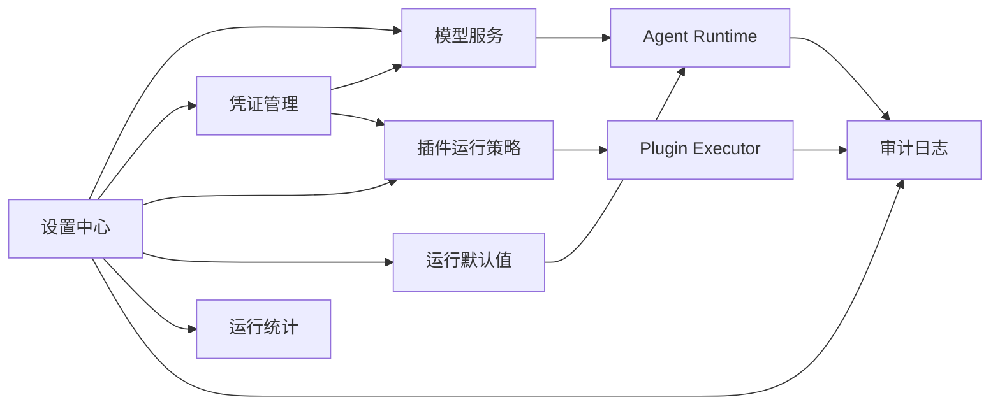

# MiniCoze 设置模块设计

## 1. 文档目标

本文定义 MiniCoze 设置模块的职责边界、信息架构和核心能力，为后续前后端设计、数据库建模、接口评审和分阶段实施提供统一基线。

设置模块只管理工作区级资源、默认策略和治理规则。已经存在且能够独立工作的个人资料、账户密码、主题、工作区基本信息、成员管理、插件定义、插件工具编辑等功能，继续复用原有模块，不在本文重复设计。

## 2. 设计原则

1. **设置管理策略，业务模块消费策略**：设置模块不编辑具体 Agent、工作流、知识库或插件工具。
2. **工作区隔离**：模型连接、凭证和运行策略均归属于工作区。
3. **服务端可信**：权限、引用关系和安全策略必须由后端校验，前端隐藏按钮不能替代鉴权。
4. **密钥不出服务端**：API Key、Token 等敏感信息只允许加密存储和掩码展示。
5. **默认值可覆盖**：系统提供兜底，工作区提供默认值，具体 Agent 可以按需覆盖。
6. **先保证运行正确，再扩展治理能力**：优先完成模型真实路由和插件凭证链路，再建设运行统计和审计。

### 2.1 当前部署约束

当前开发环境和初期部署预计使用 HTTP、服务器 IP 和端口，暂时不依赖域名与 HTTPS 证书。因此本设计不强制要求 HTTPS，也不假设所有外部或内部服务都有域名。

支持的地址形式包括：

```text
http://192.168.1.20:3000
http://10.10.0.15:8080/v1
https://api.example.com/v1
```

HTTP 不提供传输加密。管理员在设置页面提交 API Key 时，浏览器到 MiniCoze 后端之间的请求也可能被监听。
## 3. 范围边界

### 3.1 复用现有功能

以下能力不在设置模块重新实现：

- 个人资料、头像和密码修改：复用 `modules/profile`。
- 主题切换：复用 `AppLayout` 现有主题逻辑，后续可抽取公共状态。
- 工作区名称、描述、成员角色和删除工作区：复用 `WorkspaceSettings`。
- 插件定义、工具 Schema、Agent 插件绑定和工具测试：复用 `modules/plugins`。

设置中心可以提供这些页面的导航入口，但不复制对应表单和业务逻辑。

### 3.2 本期重点设计

```text
/settings
├── models          模型服务
├── credentials     凭证管理
├── integrations    插件运行策略
├── runtime         Agent 运行默认值
├── usage           运行统计
└── audit           审计日志
```

## 4. 总体架构



前端设置页面负责展示和提交配置；后端各领域 Service 负责校验、引用检查和运行时解析。不要建立一个包含所有业务逻辑的通用 `SettingsService`。

## 5. 模型服务

### 5.1 目标

建立工作区级模型资源目录，使 Agent 选择的模型与后端真正使用的 Provider、Base URL 和凭证保持一致。

当前 Agent 只保存模型名称字符串，AI Gateway 只使用启动时环境变量配置的单一 Provider。这种方式无法支持工作区级多供应商和真实模型路由。

### 5.2 功能组成

#### 服务连接

- 连接名称
- 供应商类型：OpenAI、DeepSeek、豆包
- Base URL，支持域名或服务器 IP
- 协议类型，当前允许 HTTP 和 HTTPS
- 关联凭证
- 启用状态
- 连接测试状态
- 最后测试时间和错误摘要

#### 可用模型

- 供应商真实模型 ID
- 展示名称
- 所属服务连接
- 上下文长度
- 最大输出 Token
- 工具调用、视觉等能力标签
- 启用状态
- 工作区默认模型标识

#### 管理动作

- 创建、修改、启用、停用和删除连接
- 测试连接
- 从供应商同步模型，或手动添加模型
- 设置工作区默认模型
- 查看模型被哪些 Agent 或工作流节点引用

### 5.3 关键规则

- 一个工作区可以配置多个服务连接。
- 一个连接可以管理多个模型。
- 一个工作区只能有一个默认模型。
- Agent 只能选择当前工作区已启用的模型。
- 停用或删除模型前必须检查引用关系。
- API Key 不直接存储在模型连接中，连接只引用凭证。
- 已发布 Agent 的快照保存模型资源标识和模型名称，但不保存密钥。
- 当前开发环境和初期部署允许使用 `http://服务器IP:端口` 形式的 Base URL。
- 使用 HTTP 时，页面必须提示凭证和请求内容将通过明文协议传输，但不阻止保存和连接测试。
- Base URL 必须包含完整的 `http://` 或 `https://` 协议，不接受省略协议的地址。
- 后端应拒绝 Base URL 中的用户名、密码、查询参数和片段标识，避免敏感内容进入配置或日志。
- 后续具备域名和证书条件后，生产环境应优先迁移到 HTTPS，但不将 HTTPS 作为当前阶段的强制条件。

### 5.4 数据模型草案

```text
WorkspaceModelProvider
- id
- workspaceId
- name
- providerType
- baseUrl
- credentialId
- enabled
- lastTestStatus
- lastTestMessage
- lastTestedAt
- createdAt
- updatedAt

WorkspaceModel
- id
- workspaceId
- providerId
- modelId
- displayName
- capabilities
- contextWindow
- maxOutputTokens
- enabled
- isDefault
- createdAt
- updatedAt
```

Agent 后续应从 `model: string` 迁移为 `workspaceModelId`。迁移期间可以同时保留旧模型字段，用于兼容历史数据和发布快照。

### 5.5 API 草案

```text
GET    /workspaces/:workspaceId/model-providers
POST   /workspaces/:workspaceId/model-providers
PATCH  /workspaces/:workspaceId/model-providers/:providerId
DELETE /workspaces/:workspaceId/model-providers/:providerId
POST   /workspaces/:workspaceId/model-providers/:providerId/test
POST   /workspaces/:workspaceId/model-providers/:providerId/sync-models

GET    /workspaces/:workspaceId/models
POST   /workspaces/:workspaceId/models
PATCH  /workspaces/:workspaceId/models/:modelId
DELETE /workspaces/:workspaceId/models/:modelId
POST   /workspaces/:workspaceId/models/:modelId/set-default
GET    /workspaces/:workspaceId/models/:modelId/references
```

### 5.6 运行时解析顺序

```text
请求显式指定模型
→ Agent 自身模型
→ 工作区默认模型
→ 系统兜底模型
```

解析模型后，由 `ModelResolverService` 获取连接和凭证，再由 Provider Factory 创建对应客户端。AI Gateway 不再持有全局唯一 Provider。

## 6. 凭证管理

### 6.1 目标

为模型和插件提供统一、安全的凭证生命周期管理，避免密钥分散在环境变量、插件自由 JSON 或业务表中。

### 6.2 支持范围

第一阶段支持：

- API Key
- Bearer Token
- Basic Auth
- 自定义 Header

OAuth 2.0 涉及授权回调、刷新令牌和授权状态机，作为后续独立能力实现。

### 6.3 页面信息

- 凭证名称
- 凭证类型
- 使用场景：模型或插件
- 关联资源
- 掩码值
- 状态
- 最后更新时间
- 最近使用时间
- 创建人

### 6.4 必须支持的动作

- 创建凭证
- 更新或轮换密钥
- 测试凭证
- 启用和停用
- 查看引用关系
- 删除前引用检查
- 记录敏感操作审计

### 6.5 安全约束

- 数据库只保存密文，不保存可恢复的明文字段。
- 加密主密钥来自环境变量 `SECRET_ENCRYPTION_KEY`。
- 列表和详情接口只返回掩码，不返回密文或明文。
- 日志、异常、审计差异和 Swagger 示例不得包含真实密钥。
- 更新凭证时，空值表示保持原密钥，不能误覆盖为空。
- 凭证解密仅允许在实际调用模型或插件前短暂发生。

### 6.6 数据模型草案

```text
WorkspaceCredential
- id
- workspaceId
- name
- type
- usageType
- secretEncrypted
- config
- maskedHint
- status
- lastUsedAt
- createdBy
- createdAt
- updatedAt
```

现有 `PluginCredential` 可以迁移到通用凭证表，或先保留并复用统一 `SecretService`。第一阶段不应同时维护两套加密实现。

### 6.7 API 草案

```text
GET    /workspaces/:workspaceId/credentials
POST   /workspaces/:workspaceId/credentials
GET    /workspaces/:workspaceId/credentials/:credentialId
PATCH  /workspaces/:workspaceId/credentials/:credentialId
DELETE /workspaces/:workspaceId/credentials/:credentialId
POST   /workspaces/:workspaceId/credentials/:credentialId/test
GET    /workspaces/:workspaceId/credentials/:credentialId/references
```

## 7. 插件运行策略

### 7.1 目标

插件模块继续管理“插件提供什么工具”，设置模块负责“工作区允许插件如何运行”。这样可以集中实施网络、超时、并发和日志安全策略。

### 7.2 配置项

- 默认请求超时
- 最大响应体大小
- 默认重试次数
- 工作区插件并发限制
- 允许访问的目标，支持域名、单个 IP 和 CIDR 网段
- 禁止访问的目标，支持域名、单个 IP 和 CIDR 网段
- 是否允许 HTTP，当前默认允许
- 是否允许访问私有网络，默认关闭，可由管理员显式开启
- 最大重定向次数
- 调用日志保留时间
- 是否记录请求和响应摘要

### 7.3 插件状态概览

设置页应展示运行异常，而不是重复插件编辑功能：

```text
插件            状态
网页搜索        正常
天气查询        缺少可用凭证
内部 HTTP 工具  目标 IP 未加入允许列表
```

### 7.4 HTTP 插件安全

考虑到当前开发和初期部署主要使用 HTTP、服务器 IP 和端口，插件执行器不能强制要求 HTTPS，也不能无条件禁止全部私有网段。建议采用“默认限制、显式放行”的策略。

默认规则：

- `localhost` 和环回地址
- 链路本地地址
- 云服务元数据地址
- 非 HTTP/HTTPS 协议

云服务元数据地址和非 HTTP/HTTPS 协议始终禁止。环回地址默认禁止，只有本地开发模式并经过服务端配置后才能放行。

RFC 1918 私有网段不是永久禁止项。管理员开启“允许访问私有网络”后，仍需将目标服务器 IP 或 CIDR 加入允许列表，例如：

```text
192.168.1.20
192.168.1.0/24
10.10.0.15:8080
```

允许列表应尽量精确到目标 IP 和端口，不建议直接放行整个 `10.0.0.0/8`。如果请求使用域名，后端必须在 DNS 解析后再次校验实际目标 IP；重定向后的每个地址也必须重新校验，防止通过域名或重定向绕过策略。

HTTP 在当前阶段允许使用，但页面需要展示“请求和凭证可能以明文协议传输”的风险提示。凭证仍由服务端执行器注入，不能作为模型可见参数传递，也不能出现在调用日志中。

无论使用 HTTP 还是 HTTPS，都必须限制请求超时、重定向次数、响应大小、并发数和可设置 Header。

### 7.5 数据模型草案

插件策略建议存入独立的工作区配置，而不是复制到每个插件：

```text
WorkspacePluginPolicy
- workspaceId
- requestTimeoutMs
- maxResponseBytes
- maxRetries
- maxConcurrency
- allowedTargets
- blockedTargets
- allowHttp
- allowPrivateNetwork
- allowLoopbackInDevelopment
- maxRedirects
- logRetentionDays
- recordPayloadSummary
- updatedAt
```

具体插件允许更严格地覆盖超时或目标地址限制，但不得突破工作区上限。

## 8. Agent 运行默认值

### 8.1 目标

集中管理新建 Agent 和运行时使用的工作区默认参数，避免默认值散落在前端、Prisma 和运行时代码中。

### 8.2 配置项

- 默认模型
- 默认温度
- 默认最大输出 Token
- 默认上下文消息数
- 模型请求超时
- 最大工具调用轮次
- 单次运行最大时长
- 失败重试次数

### 8.3 生效规则

```text
请求显式参数
→ Agent 配置
→ 工作区默认值
→ 系统代码兜底
```

修改工作区默认值只影响新建 Agent 和未显式设置的运行参数，不应静默覆盖已有 Agent 的明确配置。

### 8.4 数据模型草案

```text
WorkspaceRuntimeSetting
- workspaceId
- defaultModelId
- defaultTemperature
- defaultMaxTokens
- defaultContextLimit
- requestTimeoutMs
- maxToolRounds
- maxRunDurationMs
- retryCount
- updatedAt
```

## 9. 运行统计

### 9.1 目标

提供最基本的模型和插件运行可观测性，帮助管理员判断模型连接、Agent 和插件是否正常工作。本阶段只做统计展示，不做额度配置、计费或调用拦截。

### 9.2 统计指标

- 模型调用次数
- 输入、输出和总 Token
- 模型错误率和平均延迟
- 插件调用次数
- 插件失败率和平均延迟
- 按模型、Agent、插件和时间范围筛选

### 9.3 实现边界

- 复用已有运行记录、消息 Token Usage 和插件调用日志进行聚合。
- 统计失败不能阻断 Agent 或插件的正常运行。
- 暂不提供 Token 配额、并发额度、调用次数上限和费用预算。
- 暂不因统计结果自动停用模型、Agent 或插件。
- 暂不实现复杂计费和账单系统。

## 10. 审计日志

### 10.1 目标

记录会影响整个工作区运行和安全的配置变化，支持故障追踪和责任定位。

### 10.2 优先记录事件

- 模型连接创建、修改、启用、停用和删除
- 默认模型修改
- 凭证创建、轮换、停用和删除
- 插件网络与运行策略修改
- 其他危险操作

### 10.3 审计字段

```text
WorkspaceAuditLog
- id
- workspaceId
- operatorId
- action
- resourceType
- resourceId
- result
- changeSummary
- ipAddress
- createdAt
```

`changeSummary` 只能记录非敏感字段差异。凭证变更只能记录“凭证已更新”，不能保存旧值、新值或密文。

## 11. 权限设计

| 能力 | OWNER | ADMIN | MEMBER |
| --- | --- | --- | --- |
| 查看可用模型 | 是 | 是 | 是 |
| 管理模型连接 | 是 | 是 | 否 |
| 设置默认模型 | 是 | 是 | 否 |
| 查看凭证元信息和掩码 | 是 | 是 | 否 |
| 创建、轮换和删除凭证 | 是 | 可配置 | 否 |
| 修改插件运行策略 | 是 | 是 | 否 |
| 修改 Agent 运行默认值 | 是 | 是 | 否 |
| 查看运行统计 | 是 | 是 | 可选 |
| 查看审计日志 | 是 | 是 | 否 |

当前工作区角色只有 OWNER、ADMIN、MEMBER。若后续需要更细权限，应新增显式权限点，不要继续堆积角色特判。

## 12. 前端结构建议

```text
apps/web/src/modules/settings/
├── SettingsLayout.tsx
├── settings.module.css
├── components/
│   ├── SettingsSidebar.tsx
│   ├── SettingsPageHeader.tsx
│   ├── SettingsSection.tsx
│   └── PermissionGuard.tsx
├── models/
├── credentials/
├── integrations/
├── runtime/
├── usage/
└── audit/

apps/web/src/api/settings/
├── models.ts
├── credentials.ts
├── plugin-policy.ts
├── runtime.ts
├── usage.ts
└── audit.ts
```

设置页面必须覆盖加载、空状态、无权限、请求失败、保存中和危险操作确认状态。

## 13. 后端结构建议

不要把所有能力放进一个巨大 `settings` 模块。建议按领域组织：

```text
apps/backend/src/modules/
├── model-management/
├── credentials/
├── workspace-policy/
├── usage/
└── audit/
```

- `model-management`：模型连接、模型目录、测试和运行时解析。
- `credentials`：加密、掩码、轮换和引用检查。
- `workspace-policy`：插件策略和运行默认值。
- `usage`：模型与插件运行数据的只读聚合统计。
- `audit`：审计事件写入和查询。

设置 Controller 只负责请求响应，业务规则放在各自 Service。跨模块共享能力通过明确 Service 接口调用。

## 14. 实施阶段

### 阶段一：模型可用性

1. 工作区模型连接和凭证引用。
2. 模型目录和默认模型。
3. AI Gateway 动态 Provider 路由。
4. Agent 模型选择改为读取后端模型目录。
5. 历史 Agent 模型字符串兼容迁移。

阶段一完成标准：Agent 选择的模型、供应商、Base URL 和凭证在运行时真实一致。

### 阶段二：插件运行安全

1. 通用 SecretService 和凭证 CRUD。
2. 插件凭证引用。
3. HTTP 插件执行器。
4. SSRF 防护、IP/域名允许列表、超时和响应大小限制。
5. 插件运行状态概览。

阶段二完成标准：HTTP 插件可以安全执行，密钥不暴露给前端、模型或日志。

### 阶段三：运行治理

1. Agent 运行默认值。
2. 基础运行统计。
3. 审计日志。

阶段三完成标准：管理员能够观察和追踪工作区的模型与插件运行行为。

## 15. 验收标准

- 设置模块不重复实现个人资料、成员管理和插件工具编辑。
- 不同工作区的模型、凭证和策略完全隔离。
- Agent 只能选择并调用当前工作区已启用的模型。
- 模型选择能够真实路由到对应 Provider 和凭证。
- 前端、接口响应、日志和审计记录均不会泄露密钥。
- 停用或删除被引用资源时提供明确阻止或影响提示。
- HTTP 插件支持服务器 IP 和端口，并具备允许列表、SSRF、超时、重定向和响应大小保护。
- 运行统计失败不会阻断 Agent 或插件正常调用。
- 所有关键配置变更可以通过审计日志追踪。

## 16. 暂不实现

- 复杂 RBAC 权限编排界面
- 模型费用结算和账单支付
- 插件市场安装、升级和依赖解析
- OAuth 2.0 完整授权流程
- 多地域密钥托管和外部 KMS 集成
- 自动成本优化和模型故障切换
- Token、并发、调用次数和费用预算等限额处理
- 超限拦截、自动停用和计费结算
- 数据与隐私设置模块
- 数据保留策略、数据导出和历史数据清理

这些能力可以在基础模型路由、凭证安全和插件执行链路稳定后独立设计。

## 17. 主要风险

1. **历史模型兼容**：现有 Agent 只有模型字符串，迁移时可能无法唯一映射到新的工作区模型。
2. **密钥迁移**：环境变量中的模型密钥与现有插件凭证需要制定安全迁移方案。
3. **运行时耦合**：AI Gateway、Agent Runtime、工作流 LLM 节点都需要使用统一模型解析逻辑。
4. **HTTP 与 IP 部署安全**：允许访问私网服务后，配置过宽可能扩大 SSRF 风险；必须同时校验原始地址、DNS 解析结果和重定向目标。
5. **统计一致性**：Token 和插件调用统计需要处理流式中断、重试和失败场景，但统计偏差不能影响正常调用。
6. **策略生效边界**：必须明确配置修改是即时影响运行，还是只影响后续新运行。

默认建议：连接状态、凭证和安全策略即时生效；Agent 已发布快照保持业务配置稳定，但运行时密钥和安全策略仍使用最新有效配置。
